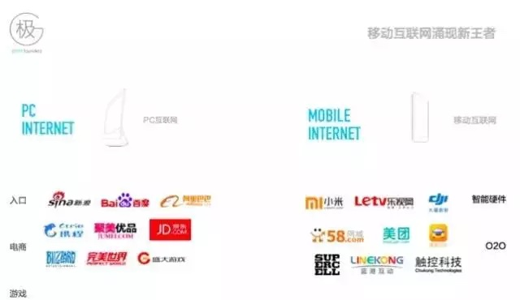
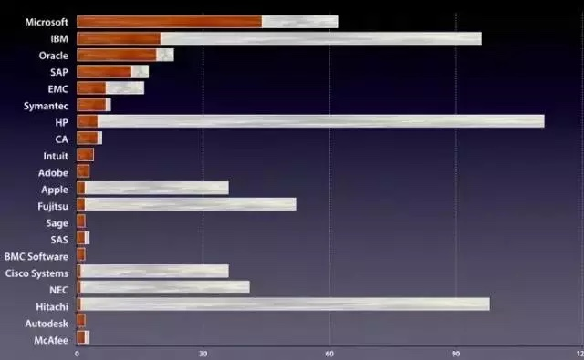
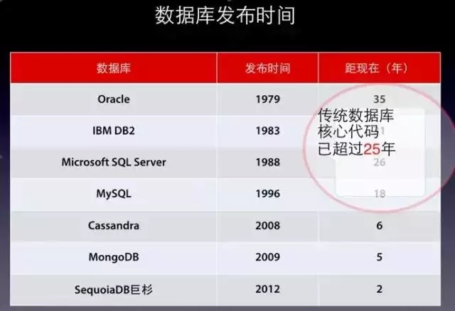

极客创业，大有可为
=====================

1. [技术人创业的优势](#1-技术人创业的优势)
1. [技术人创业的方向](#2-技术人创业的方向)
1. [对技术人创业的建议](#3-对技术人创业的建议)
1. [写在最后](#4-写在最后)

> 蒋涛，`CSDN`和《程序员》杂志创始人，极客帮基金创始人。作为中国最知名的程序员社区的开创者，蒋涛致力于中国IT技术传播，帮助几代中国程序员的成长；
> 如今以投资人的身份再次创业，倾力支持中国创业大军中的技术力量。作为最懂技术的投资人，蒋涛在`QCUC` 2015分享了对技术人创业独到而深入的观点。下文是蒋涛现场演讲速记整理。

## 1. 技术人创业的优势

我现在大部分时间在做投资，我记得我在做创业者的时候要钱特别困难。大概06年我们融一百万美金，谈了很多家，当时感觉第一讲不清楚自己是干什么的；
第二，投资人都是高高在上的。现在我开始做投资了，发现最厉害的是创业者，比如小马（小编注：马春荃），我们投他都得求着他：让我们投一点吧，我们会好好支持你发展。**_所以现在是创业者最好的时代。_**

做个调查，大家有多少是程序员出身的？有大概一半。今天分享的题目是技术人的创业时代，分享一下我的经验。我在2011年开始做投资，那一年搞云计算大会，送了十个展位给创业者，现在有七家估值过亿美金了，这就是创业的大时代。
从做投资到现在，我大概投了80多家跟高科技互联网相关的公司，我们的基金叫极客帮。

今天主要分享一下我对技术人创业的认识。因为我自己做了十几年的程序员，又服务程序员有15年的时间。下面我会从一个技术人员的创业时代、方向和建议三个点来分享。

**_第一，这确实是一个特别好的时代。_**2013年参加谷歌`I/O`大会时，_Larry Page_ 在演讲时说到，『我们所有人之所以齐聚在这里，是因为我们对科技改善人们的生活和世界的潜力充满乐观。
令我吃惊的是，每天当我来上班时，需要完成的工作总是多于前一天，而随之而来的机遇也越来越大。
我们的行业、以及谷歌、你们所有人，我们只是完成了可能性的1%，甚至连1%都不到，我们前进的速度很慢。
虽然整个行业正在经历更为快速的变化，但相对于我们拥有的机遇，我们的行动依旧缓慢。』
他们之所以能够充满激情的去做事情，最主要的原因是有太多的事情做不完，这个世界上有很多可以值得做的事情，`Google`作为一家高科技公司，希望用科技改变世界。
现在是一个『天下大乱、群雄并起』的时代，相当于西部的拓荒时代，或者是美洲的大航海时代。
我们的生活和工作都被移动化包围，企业的商业模式也随着用户的改变而改变，每个垂直领域的领导者都在重新洗牌。

上图是我们做的分析，原来的入口是`BAT`，但现在的入口已经变成了硬件，硬件将来都是软件；新的公司代替老的公司。
从大的环境上来说现在是最好的时代，不管是人才、资本，还是技术。

总结一下：

1. 技术为驱动。现在是一个产品和技术驱动的创业时代。
1. 开源降成本。创业的成本，特别是在技术上大量使用开源、云 计算，使投入变得非常低。
1. 一切可重来。所有在`PC`时代做过的事情都可以用新的方式、新的环境重新做，但是怎么做好比较有挑战。
1. 每点需深挖。比如图片，美国的`Instagram`很火，我们当时投了一家推图照抄。但是中国真正活下来的是美图秀秀，估值20亿美金，因为它占据女性市场，据说女生不修图就不发朋友圈。
还有一家叫`In`美图社区，是一个女性图片社区，更加符合女性的诉求点。创始人曾经做过`Flash`开发者社区，他们去年开始做`In`，今年刚刚宣布一轮融资，20亿人民币。我们还投了一家`See`。
比如你看到韩剧里某个人穿衣服特别好看，可以拍张照片放到`App`上，就会有人来回答你这件衣服多少钱，在哪里买的。围绕图片还有很多创新，在每一个细分领域都可以深挖。

**_第二，现在是程序员要发挥最大价值的时候，特别是在移动时代。_**`Wish` —— 是一家估值20亿美金、完全数据驱动的电商，纯技术出身。
淘宝、京东的推荐系统，推给你的是他们特别想推的东西，但是90%你都不想要。
但是`Wish`会个性化的记录你每一个浏览记录，推给你想要的东西。它的设计很特别，但都是通过数据分析的方式找到最适合的页面布局。
**_这就是技术人创业的优势。_**`Wish`怎么跟亚马逊和`ebay`竞争呢？他们在`Google`关键字搜索做了很多优化，获得买家用户的导入；
在亚马逊和`ebay`上注册，发现新店主就发一封邀请信，吸引卖家用户到`Wish`平台上。
**_这就是技术人创业的时代，_**用技术、数据的手段来优化，让它更加符合个性化的需求。

跟大家分享一个创业的小故事。有一个创业项目的创始人，在国内做技术也算是很牛逼的，曾经招了十几个实习生，他发现其中最优秀的小孩在五个月的时间就超过了他。
所以，做技术后浪拍死前浪是100%的。任何智力工作者都是这样，后一代一定比前一代更强，你要沉淀下去、不断的学习，但是后来人的进步更快。所以他觉得只能凭经验和视野出来创业。
这就是**_技术人为什么创业？第一是大时代，第二现在是产品技术驱动时代，技术人能够发挥很大的作用。第三是后生可畏，_**年纪大的同志们可以多想一想是不是该出来创业了。

## 2. 技术人创业的方向

创业的方向？从我的角度来说，极客帮基金的定位重点是`SaaS`。`SaaS`已经炒了很多年，美国一直做的不错，在中国我认为现在是一个特别好的时机。
**_第一个是做`Developer Service`，新一代工具和产品。_**比如`QingCloud`。
在美国围绕云计算、大数据、移动互联网产生了一大批新兴技术公司，获得风险投资金额超过200亿美元，正在颠覆传统老牌厂商。老牌厂商是谁呢？

上图是2012年的统计数据，全球前20名的软件公司。这些公司的名气都很大，但是他们的问题是什么呢？他们都是89年以前成立的，平均年龄47岁，太老了。

看一下数据库，`Oracle`是1979年成立的，当时`IBM`研究员写了一篇论文讲要用关系型数据库。由于当时的存储和计算都很贵，要用非常精简的设计、非常优化的查询，才能够实现比较好的效果。
`NoSQL`等新型数据库出现在2009年，我们也投资了一家数据库公司叫巨杉。所以说科技总在不断淘汰前面的技术。

程序员在美国是一个特别受尊重和富裕的行业，但在中国很悲哀，因为我们很不幸在`PC`软件时代，因为知识产权的问题，即使写了很好的软件，生活也非常困难，我也是经历那个时代过来的，还处在温饱阶段，绝对谈不上富裕。
开发者自己都不用付费的开发者工具，这个循环就会持续下去，而且习惯很难改变，需要一个扭转的过程，做云服务就是一个改变的途径。
在商业模式上，大家都相信免费驱动，但是从更长远的角度来看，每个人尊重产品和技术，你花一点钱在软件上，这些开发性的公司能让产品做得更好，反过来你也能得到价值，这才是生态链。

**_第二个投资领域是基于移动的新一代企业服务。_**现在的企业系统也都是老化的，就像老的`IT`公司一样。
新的企业服务不再是企业的内部封闭系统，而需要和互联网相关服务对接；不再只有企业后台服务系统，而是可以发现客户，直接给予客户服务和支持的系统；
不再是传统的`SaaS`订阅收费，而是通过连接互联网交易实现增值服务。

**_第三个投资领域是基于移动的新一代行业系统。_**原来不使用电脑工作的职位现在都用上手机，每份工作都被移动化，每个行业都正在被数字化。
基于移动的行业应用如教育，餐饮，地产，汽车金融，医疗等正在变革行业的商业模式。中国原来各类传统行业的信息应用都非常落后，只是封闭的内部管理系统。
新一代行业系统是发现和连接，服务用户的平台，通过移动和微信联系上下游客户并产生交易的平台。所有中介化、渠道代理服务的模式都将被垂直行业的互联网平台商取代。
其实每个行业都完成了`IT`信息化第一代，第二代就是把它的效率提升，手工的事情由电脑来做，把内部的流程、统计，特别是财务这样的系统自动化起来。

创业方向总结一下：

1. 做开发者工具服务；
1. 做企业服务；
1. 对行业进行变革，甚至对商业模式进行变革，把用户都变成互联网化。这是在`SaaS`领域的方向，不再靠订阅式收费，而是真正为用户创造可见的价值。

## 3. 对技术人创业的建议

- **_第一个技术人员不要有惯性思维，_**原来做什么，就要做什么，特别是扎堆做技术领域的创业，还有更大的市场可以做。
一堆人想做在线的程序员培训，我就跟他们说别做了，第一，我在培训领域干了很多年，这个市场不像大家想的那样。第二，程序员大部分是有自学能力，看不上你。
第三，最好的老师都忙得很，不是忙着创业，就是忙着在`BAT`等大公司里干活。
雷军给我讲过一句话，第一顺势而为，第二选择道路的时候要选宽一点的，在宽一点的道路里面打10%也比在窄的道路里打50%强。
- **_第二不要做技术改良，要产品革命。_**你的改进可能在某个点上是比他强的，但是更宏观的去看问题，用户对产品的接受度是什么？
本质需求是什么？不要做局部性能的调整，而是产品在本质上有没有突破。
- **_第三不要只管智商，要情商。_**这是比尔盖茨在今年6月份接受金融时报的采访，记者问他对公司发展有什么心得？
他说一开始创业时重视智商，一定要找最聪明的人，找程序写得最好的人，现在谷歌还是这个标准。
『等到了25岁的时候，我意识到智商有不同形式。懂销售和管理的人，他们的水平高低似乎和智商是负相关的。这在当时让我很迷惑。』 —— _比尔盖茨_。
做公司很多的时候还是要带队伍、见客户、发展自己的用户，所以要提高自己的情商，也可以找一个合伙人帮你做。
- **_第四不要太实，要虚实结合。_**
工程师出身的人太实在了，但是市场上有时候还是需要做一定的虚实结合，把自己最好的一面表现出来，把相对弱的一面做一定的掩盖。
当然不是逃避问题，而是不需要把所有问题都暴露出来。

那么，一个好的创业者需要哪些特质？

- **_第一，产品力，_**对产品的控制力。现在是一个好产品的时代，你的产品一定要比别人做得好，这是最基础的，其他都不是决定因素。作为一个优秀的创业者一定要把产品盯牢、盯好。
- **_第二，表达力。_**你的产品最终要把它表达出去，如果是做`2B`业务的，你得说服你的客户；如果需要资金，你得说服投资人；你想挖个牛人还付不起工资，也得说服他。
所以表达力是非常重要的，即使你有一个优秀的产品，传播也是很重要的。现在有了朋友圈，好的东西大家愿意分享，很重要的一点是有个性，有个性才会传播，共性就不行。
`QingCloud`之所以能够成功就是因为_Richard_太能讲了。
- **_第三，交易力。_**知识分子有一个缺点，这是和生意人的差别，他在达成目标上碰到一点困难阻碍就容易放弃，但是事实上做公司一定要克服这点。
跟人相处是比较微妙的，谈生意也一样，价格是有弹性的、工作也是有弹性的。你能不能捕捉到他的关注点，实现你的目标，我把这一点叫做交易力，很多人是特别缺乏的。

## 4. 写在最后

- 第一，这是一个最好的技术人的创业时代、技术产品驱动的时代。
- 第二，创业方向应该围绕基于移动的企业系统和行业系统去做，特别是行业系统。
- 第三，给大家一些建议，做好产品、提高自己的表达力，还有交易能力，都是很有必要的。如果不能完成的话，你就找一个合伙人。

[原文连接](http://mp.weixin.qq.com/s?__biz=MjM5NDcyNzkwMw==&mid=207817810&idx=1&sn=f7ff0cd0771487facbe69f5622ce299e&scene=2&srcid=0914Bx6KykP3cVI6sFibbFOd&from=timeline&isappinstalled=0#rd)
