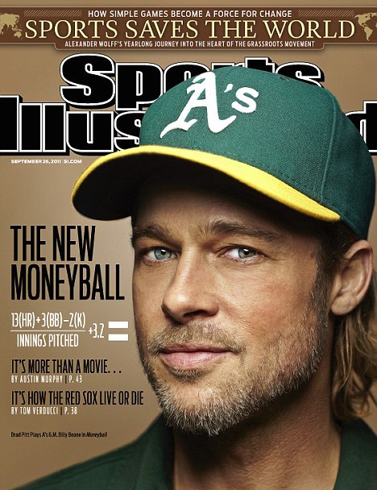

魔球，一个搞清楚产业重点的棒球故事
===============================

- [不是`Hack`，而是抓住游戏的重点](#不是hack而是抓住游戏的重点)
    - [在大联盟赚到很多钱的方法？](#在大联盟赚到很多钱的方法)
- [要从网络上赚钱，第一天就要作能有实质收入的生意](#要从网络上赚钱第一天就要作能有实质收入的生意)
- [从网络上赚到钱的秘密：『charge for your products.』](#从网络上赚到钱的秘密charge-for-your-products)
- [小结](#小结)

今天下班回家，看到 _Mr. Jamie_ 写了这一篇[魔球(Moneyball)：一个Hack Everything 的棒球故事](http://mrjamie.cc/2011/11/14/moneyball/)

电影《[魔球(Moneyball)](http://tw.movi​​e.yahoo.com/movieinfo_main.html/id=3981)》终于在台湾上映了，一样的我也还没去看。
但我同样的也要说，就算你没有要进电影院看故事，我也推荐你一定要去买[魔球](http://www.books.com.tw/exep/prod/booksfile.php?item =0010522666)这本书。

但我要推荐的理由跟`inside`的[_fOx_](http://www.inside.com.tw/2011/11/13/moneyball-startups) 和[_Jamie_](http://www.inside.com. tw/2011/11/13/moneyball-startups) 都不一样。我推荐的原因是，它是一本告诉你『要成为产业赢家就必须搞清楚竞赛重点』的书。

魔球是一本2002 年出版​​的书，现在这个版本是因应电影上映重新出过的书。中文书第一版出的时候，我正念大二。

而阅读这本书，从此改变了我对经营事业的看法。

## 不是`Hack`，而是抓住游戏的重点

_Billy Beane_ 的故事相信大家都耳熟能详。 _Mr. Jamie_ 整理了五段摘要：

* 一个老产业 + 一支穷球队
* 胜场数 = 营收
* 最珍贵的资源： 27 Outs
* 数字 > 天赋
* 第二年

我就不重新写了。

而_Billy Beane_ 的故事，让我所领悟到很清楚的一件事是： _Billy Beane_ 并不是个`Game Hacker`，而他的成功，是因找到了这场金钱游戏的本质。

（也许是我念数学系的关系，教授平常要求我们的不是去练各种技巧，而是去挖出问题本质，以自身累积出的理论与实力见题解题、见招拆招）

### 在大联盟赚到很多钱的方法？

* 如何赚大钱？胜场数 = 营收
* 如何赢球？在 27 个出局数中得到最多分
* 如何得到最多分？提高上垒率
* 如何提高上垒率？找出厉害的球员
* 没那么多钱买明星球员怎么办？找出上垒率高，但有其他缺陷导致薪水被严重低估的球员。

而Billy 所作的也很单纯，就是：『用一分钱实实在在的买下一分钱的胜利』。想办法让他的钱花的有价值。

而其他人的手段却是『买明星』，而说穿了也是用『用十块钱去赌赚一块钱的机会。』

所有人都能靠赌博赚钱，但是真正赚到钱的机率很低，所以绝大多数的球队也几乎都是花了大钱，但票房胜场惨兮兮。

## 要从网络上赚钱，第一天就要作能有实质收入的生意

本来我也觉得大联盟的砸钱游戏，荒谬可笑。

直到我踏入了网络界才发现，原来这样的剧本在各个领域内无时无刻都在上演。只是赌博游戏变成了：

* 如何在网络上赚钱？做出`PV`几百万的网站。
* 网站如何长成`PV`几百万？ => 做出很酷的网站=> 花大钱 Hire 明星团队
* 网站如何长成`PV`几百万？ => 生出很棒的内容=> 花很多钱找人产生内容、经营社群
* `PV`没有成长怎么办 => 改版增加更多更屌的实验新`feature` => RD 不够 => Hire 更多的RD
* `PV`没有成长怎么办 => 砸钱养更多的编辑生更多的`content` => 编辑不够 => Hire 更多的编辑

一年半载下来。准备的几千万资本额不够烧，就算有几百万`PV`。
等到你做到几百万`PV`的那一天，你才发现因为`PV`不能吃，转换率太低，回收的利润根本不够庞大的人事费用，然后因为你的帐面太难看，又没有`VC`想投你，最后就只能黯然收摊。

这不是在影射任何一家网络公司，而是几乎所有倒掉的网络公司都是类似的剧本。只是谁的口袋比较浅，谁先死。

### 从网络上赚到钱的秘密：『charge for your products.』

`37 Signals`的_DHH_曾经在[2008 的Startup School](http://37signals.com/speaks#startupschool) 给过一场Talk。这场Talk 曾经震撼当时的矽谷，这个影片那时还在网络上传来传去好一阵子，蔚为风潮。

因为在这场Talk中，他讲出`37 Signals`赚钱真正的秘方，这个秘方真的非常非常简单：
简单到这个言论当时造成矽谷一阵骚动，那就是：『**Charge for your products.**』

想从网络上『赚钱』？很简单，那就是先『收钱』啊！

很好笑对吧？没想到大家都在作『慈善』，做到忘记其实公司成立的目的，其实就是要『赚钱』。

## 小结

更有趣的是，这分别是2002 以及2008 的两个故事。至今你还可以在各行各业中看到，大家还是拼了命的在下大注赌博：拿自己的老底赌，去借大钱赌。

很多程式设计师总打趣，若写程式赚不到钱，那就应该回家卖鸡排。

若你打算开鸡排店，就算你炸的鸡排很难吃，你会有可能从开业第一天，就每天鸡排都免费，送到有人开始觉得你炸的鸡排很好吃，然后你才决定开始卖40 块吗？

你不会，因为如果你这样作，店开一个月就会倒了。

为什么你觉得你在网络上这样送免费鸡排不会倒？

从鸡排销售数字分析厨师手艺？ `Hack`鸡排香料秘方？

我想我从这些故事里，领悟到的是：『你要靠卖鸡排赚钱就不要免费；你要靠卖鸡排赚大钱就应该努力去把鸡排炸的很好吃，让更多人主动冲来买; 而租个豪华大摊位，挖个五星级厨师、开发榴梿鸡排口味，客人不一定会更多，但更有可能的是会让你亏到死而已...』 。

我不知道你会在[魔球这本书](http://www.books.com.tw/exep/prod/booksfile.php?item=0010522666) 和[这场Talk](http://37signals.com/speaks#startupschool) 里看到什么。

希望有机会看到你想追求的答案。

> [原文链接](http://blog.xdite.net/posts/2011/11/15/money-ball)
