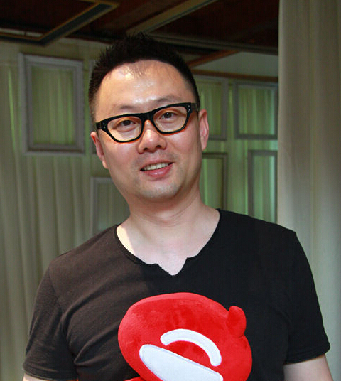

## 雕爷：三个O2O行业风生水起只靠三张图

[原文链接](http://www.iyiou.com/p/14389/)

这篇文章，过于干货，本打算发在《卖家刊》杂志，但你懂，阿芙已然六千万，但只差第一名50万元金额而已，雕爷无节操发了篇“该你还我稿费的时候了”软文，微博微信同步，然后，令人感动一幕出现了，好多同学，立即跑到阿芙天猫旗舰店疯狂购买，甚至有出现购买了2万元，然后留言“不用发货了，算帮雕爷拿第一的，反正我也不知道精油怎么用”……

实话说，我很感动。很多平时看我文章，认为受益的家伙，少则几百，多则几万，帮我们顺利在最后20分钟登顶，成为天猫双十一美妆类目第一名——顺便说一句，6届双十一，唯一蝉联美妆类目冠军的就是——阿芙。

所以我说了句，雕爷就喜欢吹牛逼，吹呀吹呀，就成了。而这次我吹的，有赖于各位帮忙，深深感恩，“你也许在别人婶婶的脑海里，还在雕爷厚厚的牛逼中”，哈哈哈……

出于感恩之心，现在把这篇文章写完，发出。要知道，这绝对是我后天学习到的管理精髓——重点是，我从来不曾在大公司工作过，毫无正统管理经验，大部分时间都是懵懵懂懂凭感觉管理，可是，我偏偏在三个行业搞得风生水起，就拿双十一来说，你以为登顶容易？我们是在同一个主流主战场，写进吉尼斯记录的全世界第一高零售交易记录，一天内把上千个国内外品牌干掉的，其中包括雅诗兰黛、欧莱雅、兰蔻等世界巨头……

言归正传，我认为：一枚优秀的企业领导者，尤其是不想失败的创业者，必须学会画`三张图`：

#### 1. 思维导图；

#### 2. PPT；

#### 3. 甘特图；

（不懂怎么画，自己去度娘Google，1和3，知易行难。）

 第一张“思维导图”，负责“天马行空”。第三张“甘特图”负责“法度森严”。中间的PPT，负责“沟通辅导”。当这三张图同步发挥作用时，我相信，这家企业既可以在“创意”方面领先对手，又能够在“执行力”上傲视群雄，时间久了，磨合越来越顺畅，越可能打造出企业的``核心竞争链``。

我们先来看“思维导图”是干嘛的——这东西又叫“脑图”，很神奇，当我思考任何问题，需要用到“发散性思维”的时候，就必定用这个武器。因为我们知道，大脑有时候想事，总是一团乱麻中，东一个灵感，西一个闪烁，如果没有梳理，其实只是胡思乱想。而有效利用思维导图的话，能奇妙的把各种凌乱念头，归拢清晰。

第三张图，“甘特图”，则是执行层面最重要的武器。小到一次常规促销，大到一次生死战役，或者新产品开发等等只要是个“项目”相关，甘特图就能保证你“节奏有序”，换句话说，用好甘特图，虽然不能保证你赢，但通常不会输在手忙脚乱——打过战役的都知道，很多时候输，不是因为对手强，而是输在自己团队协作得太蠢，甚至是某个不起眼的小环节掉链子，导致优势尽去、满盘皆输。

而中间的PPT，则是衔接这两张图的纽带。因为思维导图是一个人的“思考”，去传达给一群人去“执行”，鬼知道会出多大的理解偏差！思维导图是在“多线程”的发散思维模式下做出来的，很难给一群人讲解，而PPT则是“单线程”一条线顺下来，普通人容易听懂。

说到这，我就必须坦诚回答：我，一直以来，就是一个只会做思维导图的人——这可是天大的幸事！这可是天大的惨案！——为咩呢？你想啊，人群当中，有超常发散性思维的人，多么少呀！各种稀奇古怪的鬼点子，随时说来就来，上个厕所都能出来仨主意，任何商业难题，我都能快速思考出三五个答案……可问题是，我的执行力，简直Low爆了，正如“快刀子没法裁纸”的道理，我没耐心，暴脾气，兴趣转移太快，总喜欢尝试新鲜事务，对已经会做的事，自己做都别扭，更别说指导团队作战，更更更别说指导各个分部协同作战……

我吃了很多大亏，栽过不止一次跟头后，方才懂得，我从来就不是一个当CEO的人选，中文翻译成“首席执行官”那个。执行耶！我根本不会……还好，我终于懂了，找搭档！找那种能执行、能绘画、能监督、能跟进“甘特图”的人才！当我终于在阿芙精油、雕爷牛腩、河狸家美甲等不同领域找到牛逼搭档，嗯，长舒一口气，你也看到，我仍然游手好闲，“当懒惰的蚂蚁”，但每个版块的业务，井井有条，蒸蒸日上。

稍等，还有个PPT呢？好吧，这是我和CEO共同在学习的任务，就是把我脑海中的思维导图，婆婆妈妈、想尽一切办法讲给团队听，让他们能够真正知道“执行”的背后逻辑为何。还有，更有使命感的公司，这个工作需要有超牛的“大政委”，通常而言，在普通公司，叫HR，人力资源部，但是，在马云的阿里，就叫“大政委”，不仅仅是行政方面的HR，还是员工价值观的梳理者。

而且，越是发展迅猛的业务，越是需要大政委——拿河狸家美甲举例，都中国上门美甲第一大了，河狸家都超过所有山寨总和的10倍了，我和CEO越是觉得缺顶级大政委这种珍稀物种的加盟——我俩人花了整整半年时间，无数心血，才搞定一个大政委。有人问了，这人能提高业绩么？我的回答是：直接的业绩，一分钱都不能。但这个角色，就仿佛暴露你年龄的古董电脑游戏《金庸群侠传》中的“王语嫣”一样，单个出去打，人见人灭，可如果是“王语嫣”配合几个高手去团战，她直接给每个牛人加持50%功力！大政委也是这样，在一个团队中，她能够给每个组员安慰、辅导、和讲解清楚CEO的作战步伐。在挫折后让每个人迅速平复，在成功后快捷复盘，最终达到终极目标：团队中每个人“自备鸡血”，任何仗开战之时，稍有疲态，自己拿出血袋，给自己来一管儿，然后继续High着奋勇厮杀……

所以，如果你够聪明，就知道我虽然说的是三张图表，但实际上是三种人才。

彼得·德鲁克曾经形容，一个卓越的领导者，“需要有时候像鹰一般飞得足够高，才能纵览全局。但有时候又需要飞得足够低，才能有把握一击必中，而在这高与低之间的调节，考验能力高下。”

如果让我来形容，团队打仗则是“一群鹰”在翱翔，有只鹰负责飞得足够高，看清局势，思考节奏和速度；有只鹰则带领小伙伴飞得足够低，保持贴近猎物随时肉搏——还有只鹰，仿佛一只大喜鹊，负责唠叨，不停的唠叨，告诉鹰群小伙伴，咱们为何要这么飞呀？你饿不饿呀？你冷不冷呢？你为啥不够激情呢？没逮到猎物时，怎么鼓励？逮到猎物时，怎么庆祝？变换队形时，怎么迅速切换不走形？

最终，我的经验是：如果你是天赋异禀，能一个人完成三张图表，那你就一个人干。但你知道，就连乔布斯，也只是思维导图和PPT的天才，还得请库克去帮他完成甘特图……所以，大部分人，老老实实去找寻事业搭档吧。只要凑齐这三张拼图，那么产生的爆炸性威力，十足惊人。

读到这里，你们欠我的稿债，又开始重新计算了，慢慢攒着吧，哈哈哈哈……我真是天生的臭奸商呀~
