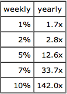

Paul Graham：创业=增长（Startup=Growth）
==========================================

一家创业公司常被定性为快速增长的公司，仅仅新创的公司还不能使其本身成为一家创业公司。对于任何一家创业公司来说，建立在什么技术上，是否拿到风险投资，或者是否具有退出机制，这些都不是必要的，其最根本的地方在于增长。

如果你也想开始你的创业之旅，那么明白这点将非常重要。创业是如此的困难以致于你不能将其晾在一边并期待获得成功，你必须明白增长是你自始至终都需要追寻的。好的消息是，如果你获得增长了，那么其它任何事情都会自然而然的各归各位，这也就意味着你可以将增长作为你前进道路上的指南针，让你在面对所有需要时做出决策。

参天大树（Redwood）
------------------

我们从最明显也是经常被忽视的地方开始谈论这个话题：并非所有新创的公司都是创业公司。在美国，每年新创的公司达上百万个，但只有很少一部分是创业公司。大多数都是服务性商业——餐馆、理发店、水管业务等等，除了非常少见的个案外，这些都不能称作是创业公司，一个理发店就从不会被定性为快速增长的公司，但是一个搜索引擎公司就显然是。

当我说创业公司被定性为快速增长时，我的意思在两方面是显而易见的。其一我所说的定性或者设计（designed）在某种意义上说是具有目的和准备的，因为大多数创业公司都会失败。但是从天性自然的一面来说，创业公司又是不一样的，因为一棵参天大树的幼苗从其发芽开始就具有不同的命运。

其区别就在于为什么会有一个不一样的词 “startup”，来专门描述那些快速增长的的公司。如果所有的公司从本质上都一样，但是其中一些依靠运气或者其创始人的努力使其获得快速增长，那我们也不需要一个单独的词汇来描述了。我们只需要将其成为非常成功的公司和不太成功的公司。但是事实上，创业公司都具有与其它商业完全不一样的 DNA，Google 并不是一个创始人很幸运或者非常努力而成功的理发店，Google 从一开始就与众不同。

要获得快速增长，你必须打造一些能向大众市场出售的东西（产品或者服务），这就是 Google 与一个理发店的区别所在，一个理发店（barbershop）并不具备规模化扩张的性质。

对于一个快速增长的公司，它必须具备：

- 提供的业务（产品、服务）是大多数人想要的
- 所提供的产品或者服务能覆盖所有的这些人并为他们服务

在第一条上，理发店非常契合，因为每个人都需要理发。但是其面临的最大问题就在于连锁店的建立，也就是说它不满足第二条。一个理发店的服务对象是个人对个人，很少有人会为了理个发不远千里而前往某个店，但就算有人愿意如此做，理发店也不太可能容纳得下。

开发软件是解决第二条的最好方式，但是你最终又会受第一条的约束。如果你开发一个软件教匈牙利人讲藏语，那么你可以覆盖到大多数想要的人，但是这个市场仍然太小；如果你开发的软件是教中国人讲英语，那就不一样了，此时你就处于创业的领域了。

大多数商业要么是被第一条约束，要么是被第二天约束。而成功创业公司的不同之处就在于以上两条都无法约束自己。

想法（Ideas）
-------------------

开始一段创业旅程似乎比开启一项普通的商业要好很多，如果你正准备创立一个公司，为何不从最具潜力的类型开始呢？问题就在于这是一个非常高效的市场，如果你为匈牙利人写个教藏语的软件，你不会遇到太多竞争；而如果你写个为中国人教英语的软件，你面对的将是非常激烈的竞争，因为很显然，它能带来的回报也要大得多。

那些限制普通公司快速成长的约束条件其实也是在保护它们，这是一种折衷或者说权衡。如果你开一家理发店，那么你只需要与当地的理发师竞争；而如果要打造一个搜索引擎，那就得与全世界进行竞争了。

然而对于限制普通业务发展的约束条件来说，其最重要的保护并非来自于竞争，而是新想法（idea）的匮乏。如果你在某个特殊街坊旁边开了一家理发店，所处的地理位置不仅限制你未来发展或保护你免受竞争对手的强大竞争，它也帮助你定义了你的公司。酒吧 + 街坊（Bar+neighborhood）是开展小商业一个很好的想法，当然这样的公司受到条件一的约束。你所处的领域（niche）不仅保护了你，也定义了你（是什么）。

当你想真正开始创业时，那你就不得不去思考一些非常新颖的东西。一个创业公司必须能向更大的市场提供某种服务或者产品，这些想法是如此的价值连城以至于其它所有显而易见的理念都已被抛弃。

想法的空间已被翻了个遍，因此创业公司必须建立在那些被所有人都忽略掉的基础之上，我之前说道人们应该努力去寻找那些被其它大多数人忽略掉的想法，但是那并不是大多数创业公司开始的地方。很多时候，成功的创业公司之所以出现，是因为其创始人看到了其它人没有看到而在他们看来是显而易见的想法。也许在后来他们会发现，他们之前发现的那个想法确实是其它很多人的盲点，进而从这点开始努力开始。但是当成功的创业公司正式启动的那一瞬间，其大部分的创新都是无意识的。

因此成功创业者的不同之处就在于他们能看到不一样的问题，擅长于技术并能直面那些通过该技术解决的问题，这两者是一个非常好的组合，因为技术的变革是如此的迅速，很多不好的想法会在不经意间就变成好的想法。苹果联合创始人 Steve Wozniak 当初遇到的问题是想要拥有自己的一台电脑，这在 1975年 那个时候是不同寻常的一个问题。但是技术的变革正在将其变得非常普通，因为他不仅想要一台电脑，而且还知道如何去建造它，Wozniak 可以自己建造一台。而他为自己解决的问题随后演变成为苹果为几百万人解决的问题。但是在那个时候，Wozniak 的想法显然对普通人来说是一个非常大的市场，于是苹果公司建立了起来。

Google 同样具有类似的初始经历。Larry Page 和 Sergey Brin 想去搜索网页，但是与大多数人不一样的是，他们具有技术方面知识，这让他们不仅可以发现现有搜索引擎的不足之处，还知道如何去改善它们。在随后的几年里，他们遇到的问题成为每一个人都会遇到的问题，因为随着网页的快速发展你不得不去选择一个比较好的搜索引擎，而这个过程中你就会发现旧有的算法不够好。就像发展苹果身上一样，当其它所有人都认识到搜索的重要性时，Google 已经牢牢的处于有利地位了。

这是创业公司想法（idea）与技术之间的一个连接，某个领域的快速变革会揭开并解决其它一些领域的大问题。有时候这些变革是进步，并且它们改变的东西是可以解决的。这就是驱动苹果出现的那种变革，芯片技术的变革最终让 Steve Wozniak 设计出他能承受的计算机。而在 Google 这一案例，最重要的变革是网页的快速增长，而它改变的正是那时候没有解决但是具有巨大需求的市场。

另一个创业公司和技术的连接则在于创业公司建立了一种新的做事情的方式，从更广泛的意义上来说就是新的技术。当一个创业公司不仅开始于由技术驱动而产生的想法，而且其产品中也包含了这些技术时（我们平时所称的 “高科技”），此时将两者进行合并就非常容易。但是以上的两种连接原理是不太一样的，在第一种连接中，我们创立的创业公司既不是由技术变革驱动，同时其产品往往也不会包含相关技术，除了某些广泛意义上的技术。

速率（Rate）
-----------------------

那么一个公司的增速要多快才能算是一个创业公司呢？这并没有具体的答案。“startup” 是一个极、杆（pole），而不是一个阀值（threshold）。在最开始的时候，启动某个项目与一个理想宣言相差无几，你正在努力的不应该仅仅是创立一家公司，而是开启一家快速增长的公司，与此同时你需要搜寻符合其类型的一些想法。但是在刚开始时，你有的只不过是一些承诺而已。开始一家创业公司就像作为一位演员一样，“演员” 也是一个 pole（极），而不是一个 threshold（阀值）。在他开始自己的演艺职业生涯时，一个演员就是一个不断去试镜的服务员，不断的工作使他成为一个成功的演员，但是当他成功时却不一定仅仅成为一个演员。

因此真正的问题不是什么样的速度使一个公司成为一家创业公司，而是成功的创业公司都倾向于什么样的增长速度。对于创始人来说，这不仅仅是一个理论问题，因为它也就等价于问你是否处于正确的轨道上。

一般来说，成功创业公司的增长速度会经历以下三个阶段：

- 在搞明白自己正在做什么最初这个阶段，创业公司的增长速度非常缓慢或者没有任何增长
- 随着创业公司已经明白大多数人想要什么并且如何去覆盖这部分人，这段时间的增长将非常快速
- 最终成功的创业公司将变成一家大公司，此时增速将放缓，这部分原因在于内部的局限，另一部分原因则在于公司服务的市场已经开始限制其发展

将这三个阶段放在一起就形成一个 S 曲线，而真正决定了一个创业公司的是其第二阶段的增长，其长度与斜率（坡度）决定了公司将成长为多大。

斜率是公司的增长速率，如果要定义一个让每个创始人都了解的数字，那就是公司的增长速率，这也是衡量一个创业公司的指标。如果你还不知道这个数字，那你也就不知道你目前做得是好还是不好。

当我第一次见很多创始人时，会问他们的增速，有时候他们告诉我 “我们每个月会新增 100 位新客户。” 这不是增速，我真正关心的不是其新客户的具体数据，而是相对于现有用户来说，新用户所占据的比率。如果你每月都能获得一个恒定数量的新用户，那么你就有麻烦了，因为这意味着你的增速在下降。

在 Y Combinator，我们每周都要测量其增速，这部分原因在于每个创业公司离 Demo Day 的时间非常简短，另一部分原因则在于早期的创业公司需要快速了解来自用户的反馈，以不断调整自己目前正在做的事情。

在 YC，一个比较好的增速在每周 5-7%，如果每周能达到 10%，那么你做的就已经非常优秀了。但是如果你只能做到 1%，那么说明你目前所做的事情是有问题的。

评估增速的最好方法则是营收，而对于还未获取收入的创业公司来说，另一个方法是活跃用户。这样做的合理性在于无论创业公司是否开始赚钱，其营收都可能会是其活跃用户量的某个恒定倍数。

指南针（Compass）
------------------------

我们经常建议创业公司去获得他们认为可以达到的一个增速，而他们也仅仅是尽可能的试图去实现其目标。这里的关键词是 “仅仅”，如果他们决定每周的增速要达到 7%并且最终达到了，那么他们在那周就成功了，除此之外他们没有其它任何需要做的；但是如果他们没有达到，那么在这一点上他们就失败了，并且将有相应的警告。

程序员会认识到我们在做什么，我们正在将一个刚刚开始的创业公司变成一个可优化的问题。任何尝试过优化代码的人都了解聚焦于某个狭窄点会产生多么惊奇的影响，优化代码意味着要将现有的程序进行简化、改变，通常简化的结果是花费更少的时间和内存。你不必去搞懂程序是如何运作，只需让其运转的更快。对于大多数程序员来说，这是非常满意的成果。更窄的专注可以让你感受到解决问题是多么的快速。

专注于达到某个增长速度，可以简化创业过程中遇到的复杂问题，你可以使用这个目标增长率为你所有的决策服务，任何需要为此增长目标服务的都是正确的。你是否要花两天时间参加近期的某个会议？是否需要再雇佣一个程序员？是否要专注于市场？是否要花费时间在某些大客户身上？产品是否需要增加某个功能？所有这一切只要能以你制定的增长率为中心，都可以做出决定。

对自己做每周的增长评估并不意味着你不用长远思考，一旦你经历了某周没有达成目标（这是唯一最重要的事情，而你却失败了）后的痛苦，你在未来遇到类似痛苦时，你会对所有可能让你减轻痛苦的事感兴趣。你将愿意去雇佣新的程序员，他也许不会在本周为你贡献增长率，但是其带来的一些新功能在未来的某个月可能会给你带来大量用户。但是做出这样的决策必须满足以下两个条件：

- 雇佣新人的干扰不会对你短期的目标造成影响
- 如果不雇佣新人，你有足够理由担心自己将无法达成目标
- 因此这不是说不考虑其未来，而是要考虑是否有必要。

理论上来说，类似这种爬山式的增长方式会给创业公司带来麻烦，他们可能会停止于某个局域最高点。但是事实上这样的事情从不会发生，每周必须达到某个增长率可以让创始人不得不行动起来，而相对于不行动或者无动于衷来说，行动成功的概率要高很多。90%的案例证明，坐等策略只是拖延的另一种形式。对于要攀登哪座高峰，创始人的直觉往往比他们的认识更好。再加上创业点子并不是那么的尖刻（spiky）和孤立，大多数好的点子（idea）旁边往往有更好的 idea。

优化并专注于增长带来的最大收益就是这个过程可以让你发现更好的创业 idea，你可以将实现这个增长目标的过程中所需要的东西作为前进的一个压力。如果从最原始的方案开始并根据需要不断调整以保持增长，比如说每周 10%的增长率，那么最后你会发现，你的公司与最初的设想可能完全不一样。但是任何能让你在每周保持 10%增长率的 idea 肯定会比你最初的 idea 好很多。

与小型商业相类似，定位于某个特定区域而受到约束的条件帮助定义了一个酒吧，以某个速度持续增长的约束则帮助定义了一个创业公司。

你最好遵循你成长过程中遇到的各种约束条件的引导，而不是被你最初的愿景所左右；就像科学家始终遵循事实的引导而非受自己想当然所影响一样。当理查德·费恩曼说，对自然的想象力比对人的想象力更深远时，他的意思是说如果遵循事实和真相，你会发现更多酷的东西。在创业公司一样，作为约束条件的增长率就像事实和真相，每个成功的创业企业至少有一部分来自于对产品增长的想象。

价值（Value）
--------------------

要找到每周都以几个百分点增长的产品是非常困难的，但是如果你找到了你可能就发现了某个金矿。看了下面的表格你就一目了然：

我们的祖先很少能遇到这种呈指数增长的案例，因为我们的直觉在这里是起不到任何指导作用的。当这样快速增长的创业公司出现时，即使是创始人也会感到震惊。如果一家公司每周的增长率是 1%，那么其一年的增长率就是 170%；而当其每周增长率为 5%时，其一年的增长率就是 1260%。如果该公司每个月的收入为 1000 美元（这在 YC 的早期是很典型的一个数字）并且每周保持 1%的增长率，那么 4年 后它每月的收入是 7900 美元，这比硅谷地区一个好的程序员的工资还少。而如果一个创业公司每周增长率保持在 5%，那么 4年 后它每月的收入将达到 2500 万美元。

增长率上的小变化在最后的结果上将产生非常大的区别，这就是为什么会有一个单独的词汇 “startup” 来描述创业公司，以及为什么创业公司所做的是一般公司不能做的事情，比方说融资、被收购。当然，这也是它们频繁失败的原因。

考虑到一家成功的创业公司将变得如何的价值连城，如果其失败率不高，任何熟悉这种期望价值的的人都会感到震惊。如果一家创业公司能给其创始人带来 1 亿美元的收入，那么即使其成功的机会只有 1%，他建立这家创业公司的期望价值也高达 100 万，而一群聪明而又有决心的人组合在一起，其成功的概率肯定超过了 1%。对于某些合适的人——比如说年轻时的比尔盖茨，其成功的可能性在 20%-50%之间，这也就不难理解为何那么多人都想去投资他。在一个有效市场中，失败创业公司的数量与成功创业公司的数量是成比例的，这也就是说，如果成功的创业公司越多，失败的创业公司也应该越多。

这就意味着在任何时候，绝大多数创业公司的工作将建立在没有任何人涉足过的领域，并将这种努力称之为创业。

这并不会困扰到我，这与其它那些 Beta 系数较高的职业如演员、小说家一样。我曾经长时间的习惯于此，但是它看起来似乎给很多人带来了困扰，特别是对于那些打造普通商业的人来说，有些人不明白为何这些所谓的创业公司能获得所有人的关注。

如果他们退后一步看到完整的画面了话，他们也许就不会那么的愤愤不平。他们所犯的错误在于其观念仍然基于祖先们对中值（中位数）的看法，而不是平均值。如果你对创业公司的评判标准是基于中间值，那么创业公司的整个概念开起来都是一个诡计。你不得不发明一个泡沫来解释为什么创始人想要启动自己的创业项目以及投资人想去投资他们。但是在一个拥有如此多变量的领域使用中值概念是错误的，如果你看其平均收益而不是中值，那么你就能明白为什么投资人喜欢他们，以及如果他们不是中间值类型的人，那么他们选择创业就是一个理性的选择。

交易（Deals）
------------------

为什么投资人如此喜欢创业公司？为什么他们如此热衷于投资图片分享类 App，而不是那些能固定赚钱的商业？显而易见的理由并非那么显而易见。

任何一项投资的测试都是一个风险回报率问题，创业公司能越过这个测试是因为，尽管其承受了巨大的投资风险，但是一旦成功，其收益将非常高。但这并非投资人喜欢创业公司的唯一原因，对于普通增长缓慢的商业来说，如果其风险与回报都保持在一个非常低的水平，那么风险回报率会比较好，那么为什么 VC 仍然只对高增长的公司感兴趣呢？原因就在于它们能通过收回资本获得回报，特别是在创业公司进行 IPO 后，或者被收购时。

另一个从投资中获得回报的方法是股息的形式，尽管也能从中获得一定比例的收益，但是很少有 VC 投资这些公司，这又是为何呢？因为人们很容易通过控制一个私人公司将盈利转移到自己钱包（比方说高价购买自己控制的供应商的配件产品），这就使得公司的盈利状况看起来不好。任何通过投资私人公司获得股息的人都需要时刻关注其报表。

而 VC 们喜欢投资创业公司则并不仅仅是因为其回报，还有一个原因是他们的投资比较容易监管。创始人没法在不让投资者获益的情况下自己获益。

那为什么创始人们都想要拿 VC 的钱呢？增长！好的 idea 和快速增长之间的约束要在两个方向上都能运转，不仅仅需要一个规模化的 idea 实现增长。如果你拥有这样一个 idea 但不能实现快速增长，那么你的竞争对手很快就会赶上。增长太慢对于具有网络效应的业务来说尤其危险。

几乎每个公司都需要一定的资金来启动其项目，但是创业公司即使在它们能实现盈利的情况下也经常融资。出售一个盈利性公司股票的行为可能看起来显得比较愚蠢，但是它肯定比购买保险聪明。从本质上来说，这也是大多数成功的创业公司看待融资的方式。公司可以用自己的盈利来实现增长，但是来自 VC 的资金可以让增长得更快速。融资可以让你选择更快的增长速度。

用资金来实现快速增长往往是大多数好的创业公司对 VC 的要求，因为 VC 们更需要它们，而不是它们更需要 VC。如果愿意，一个盈利性创业公司可以通过自己的盈利来实现增长，增速缓慢可能会有一定风险，但是不太可能会倒闭。而 VC 们则需要投资创业公司，特别是非常好的创业公司，否则它们就可能被挤出市场。这意味着任何拥有足够前途的创业公司都可以获得资金，并且由于这些规模大的成功创业公司，VC 们仍然可以从其投资中获得收益。

几乎所有成功的创业公司都会收到来自其它公司的收购意向，为什么呢？是什么让其它公司想去收购这些创业公司呢？

从本质上来说都是一样的，每个人都想要成功创业公司的股票：一个高速成长的公司是具有很大价值的。比方说 eBay 购买 Paypal 是一件很好的事情，因为 Paypal 现在占据了其销售的 43%以及更多的增长。

但是收购方有更多想要创业公司的理由，一个高速成长公司不仅仅有巨大价值，但同时也是危险的。如果保持扩张，它可能会侵入收购方自己的领域，很多产品收购同样也是基于这方面的担忧，就算收购方没有被创业公司自己威胁到，它们也可能会想到某个竞争对手。从这个角度来说创业公司对于收购方具有双倍的价值，因此收购方往往愿意比一般的投资者付费更多。

理解（Understand）
------------------------

创业者、投资者以及收购方的组合形成了一个自然的生态系统，这个生态运行良好，但是那些不理解的人就趋向于发明一些阴谋论来解释某些事情。就像我们的祖先曾经对自然工作原理（如地球是否圆的）的解释一样，但是它的运作没有秘密。

如果你从错误的假设（Instagram 毫无价值）开始，那么你只能通过给 Mark Zuckerberg 发明一个秘密老板强制其购买 Instagram 来解释这宗收购了。对于那些知道这种假设是荒谬的人来说，Mark Zuckberg 买下 Instagram 是因为它是具有价值的，同时也非常危险，而真正让他做出这个收购决定的是它的快速增长。

如果你想要理解创业公司，理解增长，我想说的是增长驱动了世界上的任何东西。它也是为什么创业公司经常都是基于技术的——因为具有快速增长公司的 idea 是如此的稀少，而找到这样 idea 的最好方法就是去发现近些年的一些变革，在这里技术是驱动快速变革的最好源头。增长也是那么多创业者选择创业最理性的选择，因为：增长使成功的公司是如此的具有价值，以致于尽管拥有巨大风险，但是创业者的期望价值仍然很高。增长是 VC 们为何想对创业公司投资的主要原因：不仅仅因为其投资回报非常高，而且比起投资与股票获取股息分红，投资创业公司将更容易监管。增长解释了为什么大多数成功的创业公司即使在它们不怎么需要钱的情况下仍然会从 VC 那里获得投资：它可以让它们选择自己的增长率。同时增长解释了为什么大多数创业公司会收到很多公司的收购，收购一家快速成长的公司不仅很有价值但也危险。

如果你想要在某个领域获得成功，你就需要理解那些驱动力。理解增长本身就是创业过程的组成部分。当你创业时你真正做的事情是解决比普通商业更难的一些问题，你需要去搜寻那些能带来高速增长的 idea，因为这些 idea 非常有价值，要找到则非常困难。创业公司是目前为止体现你新发现的最好媒介，开始创业的旅程与你决定做一个研究员一样：你不是去解决任何特定的问题，你不能确切的知道哪些问题可以解决，但是你必须试着去发现之前没有被发现的东西。一个初创公司的创始人做的事情实际上跟一个经济学家类似，他们大多数不会有非常显著的发现，但总有人会找到一些相关性的。

via：  
[Paul Graham](http://paulgraham.com/growth.html)

原创文章，作者：JohnTian

> [原译文连接](http://36kr.com/p/155310.html)
